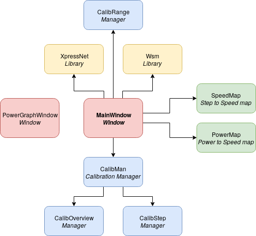

# Automatic Calibration SW

Automatic Calibration SW is a desktop application which allows you to
automatically calibrate your model train vehicle.

This application is developed in [QT](https://www.qt.io/).

*More information will be added here when the project reaches alpha state.*

## Resources

 * [WSM PCB](https://github.com/kmzbrnoI/wsm-pcb)
 * [WSM FW](https://github.com/kmzbrnoI/wsm-fw)
 * [WSM Speed Reader](https://github.com/kmzbrnoI/wsm-speed-reader)

## Building & toolkit

This SW was developed in `vim` using `make`. Downloads are available in
*Releases* section.

Howto build:

Clone this repository (including submodules!):

```
git clone --recurse-submodules https://github.com/kmzbrnoI/automatic-calibration
```

And then build:

```
$ uic main-window.ui > ui_main-window.h
$ uic power-graph-window.ui > ui_power-graph-window.h
$ mkdir build
$ cd build
$ qmake ..
$ make
```

To make debug binary, run:

```
qmake CONFIG+=debug ..
make
```

You may use [this script](https://serverfault.com/questions/61659/can-you-get-any-program-in-linux-to-print-a-stack-trace-if-it-segfaults) do debug segfaults.

## Connecting to WSM

 * Windows: pair it with HC-05 module, serial port should be added
   automatically
 * Linux: pair it with HC-05 module and map it to new serial device:

    ```
    rfcomm connect /dev/rfcomm0 hc-05-hw-address 2
    ```

## Project description

This project consists of several C++ classes defined in header files and
its implementations defined in `.cpp` files. All classes are described in
diagram below:



Squares are classes (in this project singletons), the arrow represents
relationship *owns*. Red classes are Window classes, `MainWindow` basically
owns everything, yellow classes are libraries, blue classes are managers and
green classes are helpers.

Basically all the managers use all the libraries and helpers. Helpers are
connected to GUI to visualize its states. Libs and helpers are passed to
managers as references.

`CalibMan` manages whole process of calibration divided into two phases
(`CalibOverview`, `CalibStep`), see [`calib-man.h`](calib-man.h) for more
information.

All visualized classes inherit from `QObject` and usually communicate with
*outer world* by receiving function calls and calling Qt's signals.

Each header file contains a docstring, so see it for more information.

## Style checking

```
$ clang-tidy -extra-arg-before=-x -extra-arg-before=c++ -extra-arg=-std=c++14
```

## Authors

 * Jan Horacek ([jan.horacek@kmz-brno.cz](mailto:jan.horacek@kmz-brno.cz))

## License

This application is released under the [Apache License v2.0
](https://www.apache.org/licenses/LICENSE-2.0).
